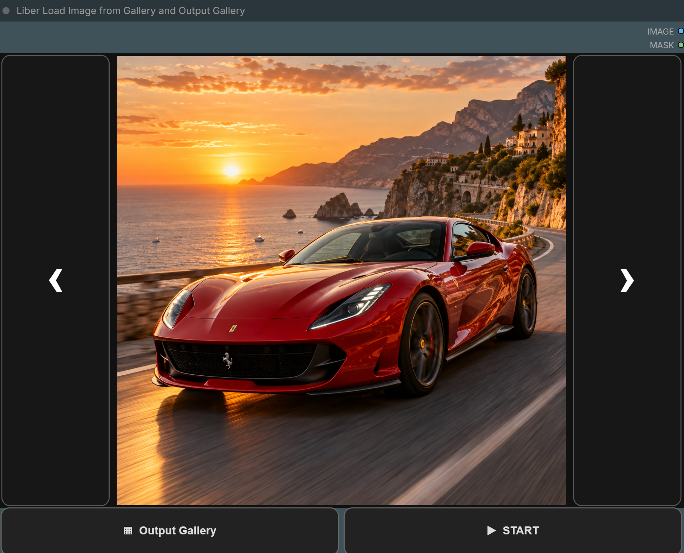
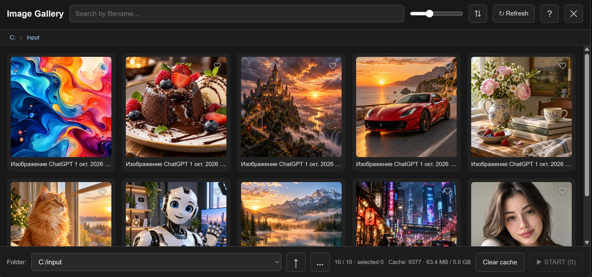
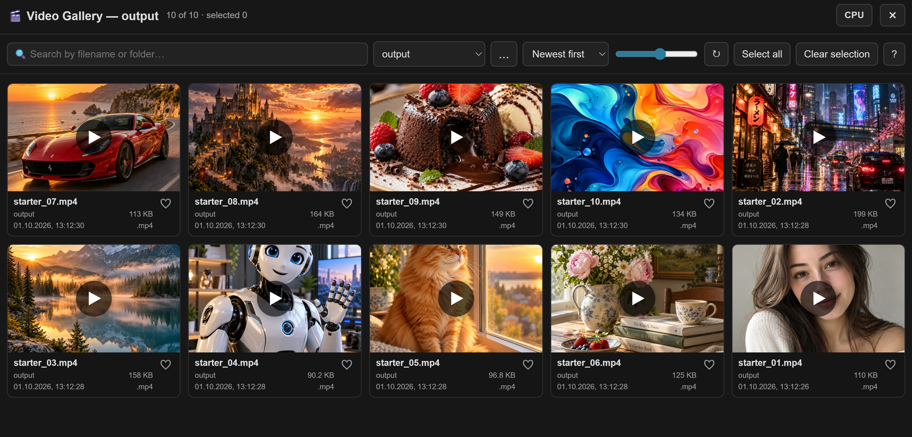

# Liber Load Image from Gallery and Output Gallery

<p align="center">
  <strong>🇬🇧 English</strong> &nbsp;|&nbsp; <a href="./README_RU.md">🇷🇺 Русский</a>
</p>

Image and video gallery for ComfyUI with fast browsing, selection, playback, fullscreen controls and external-folder support.

## Quick start

Add the **Liber Load Image from Gallery and Output Gallery** node to your workflow.

The node provides:

- **Output Gallery** — work with videos;
- the current image preview — opens the image gallery;
- **START** — queues selected images one by one;
- **IMAGE** and **MASK** outputs.



## Scenario 1. Choose one image

1. Click the image preview in the node.
2. Find the file using folders, search, sorting or favorites.
3. Double-click the image.
4. The image is loaded into the node and the gallery closes.

When the workflow is opened again, the last selected image is restored automatically.



## Scenario 2. Browse images directly in the node

Navigation arrows sit beside the preview. They are active when the current folder contains several images.

- **‹** — previous image;
- **›** — next image.

The file list loads automatically when the workflow opens or the selected folder changes; you do not need to open the gallery first. Arrows are dimmed while the list loads or when the folder contains fewer than two images. Their position does not depend on the image aspect ratio.

## Scenario 3. Queue several images

1. Open the image gallery.
2. Select images with single clicks or rectangle selection.
3. On a touch screen, hold and then drag to select an area.
4. Press **START**.

The selected images are sent to the ComfyUI queue one after another. After START is pressed, queueing continues even if the image gallery is closed before every prompt has been added.

## Scenario 4. Save and reuse image sets

Use **Sets ▾** in the bottom bar when you want to keep an ordered group of images for repeated runs.

1. Select the images you need.
2. Press **Sets ▾**.
3. Choose **+ Create from selected** and enter a name.
4. Later, click the set name to restore that set as the current selection.

The saved set preserves the current selection order. With individual clicks, this is the click order; if you deselect an image and select it again, it moves to the end of the selection order.

Open **⋮** next to a saved set to edit it:

- **Replace with selected** — replace the whole set with the current selection;
- **Add selected** — append selected images that are not already in the set;
- **Remove selected** — remove only selected images that are present in the set; selected images outside the set are ignored;
- **Rename** — change the set name;
- **Delete** — remove the saved set;
- **Start** — queue the whole set immediately in its saved order without first loading it into the current selection.

Sets can contain images from different folders, including external folders. They are shared between workflows and nodes and are stored in `ComfyUI/user/image_gallery_sets.json`, not in the workflow file.

## Scenario 5. Use another image folder

1. Open the image gallery.
2. Browse nested folders or press **...**.
3. Use **...** to choose any available folder in the system folder picker.
4. Recently used external folders can be reopened quickly.

Folder cards show a preview: up to four thumbnails from the folder and its image count. A folder with no images of its own borrows them from its subfolders. Previews load as you scroll and share the thumbnail cache; **Refresh** reloads them.

## Scenario 6. Find images faster

You can:

- search by filename;
- sort by name, date or file size;
- press **Subfolders** to show the folder's images together with all images from its subfolders;
- change preview size;
- add images to favorites;
- copy, paste and save images from the context menu.

## Scenario 7. Open the video gallery

1. Press **Output Gallery**.
2. Choose `output` or a previously opened external folder.
3. Press **...** to select a new external folder.
4. Use search, sorting, favorites and card size to find the video you need.

If a new file is not visible yet, press **Refresh**.



## Scenario 8. Watch videos

- Single click — play or pause.
- Double click — enter fullscreen.
- Double click again in fullscreen — exit fullscreen.
- Horizontal swipe over the video — seek backward or forward.
- Mouse wheel over the video — change volume.
- Videos loop automatically.
- Playback speed and volume are remembered.

After leaving fullscreen, the last viewed video plays in its own card at the same position, including favorites and CPU playback. Playback resumes even if the video was paused before exiting.

The volume slider remains available on small previews. Click the speaker to mute or restore the previous volume; the mouse wheel also changes volume.

Fullscreen controls on the right:

- **⏮** — previous video;
- **⏱** — playback speed;
- **⏭** — next video.

Controls hide after a short period of inactivity. Move the mouse, touch the screen or press a key to show them again. While paused, the interface stays visible.

## Scenario 9. Watch videos while the GPU is busy

If normal playback becomes slow during generation:

1. Open **Output Gallery**.
2. Enable **CPU** in the top bar.
3. Play the video normally.

CPU mode keeps the same main actions: play/pause, seeking, volume, speed, fullscreen and previous/next video.

Press **CPU** again to return to normal playback.

## Scenario 10. Manage video files

The video context menu lets you:

- play a file;
- select it;
- copy it;
- rename it;
- reveal it in its folder;
- delete it.

For several files:

1. Select the videos you need.
2. Copy them to the clipboard.
3. Paste them in Windows Explorer with **Ctrl+V**.

You can also delete several selected videos at once.

If a video contains saved ComfyUI workflow data, use the corresponding context-menu action to open the workflow.

## Scenario 11. Use favorites

Click the favorite icon on an image or video card. Favorites make frequently used files easier to find again without losing your current gallery position.

## Built-in help

The **ⓘ / Help** control for the image node and the **? / Help** button in the video gallery open short guides in the selected language. The image guide covers selection, folders, saved sets, ordered set runs and background queueing; the video guide covers playback, fullscreen, gestures, CPU mode and file management.

## Language

The interface supports **English and Russian** and follows the language selected in ComfyUI.

## Installation

Open a terminal in your ComfyUI `custom_nodes` directory:

```bash
git clone https://github.com/ATOM60/ComfyUI-LoadImageGallery.git
```

Restart ComfyUI.

Node name: **Liber Load Image from Gallery and Output Gallery**.

## Updating

From the installed node folder:

```bash
git pull
```

Then refresh the frontend. Restart ComfyUI when the update also changes backend files.

## Repository

https://github.com/ATOM60/ComfyUI-LoadImageGallery
