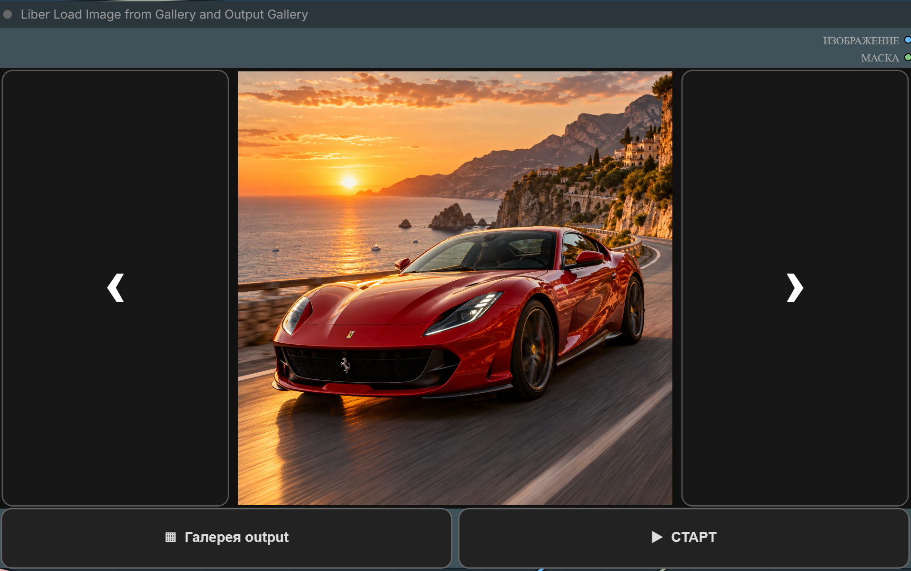
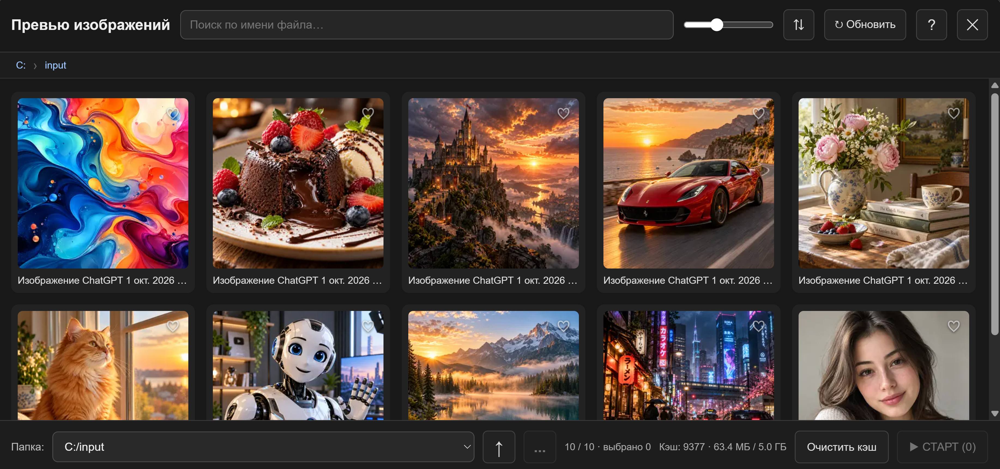
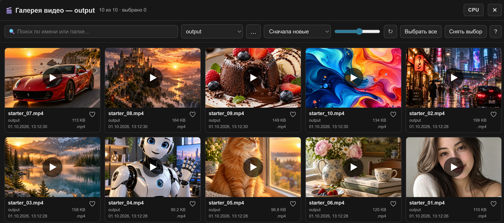

# Liber Load Image from Gallery and Output Gallery

<p align="center">
  <a href="./README.md">🇬🇧 English</a> &nbsp;|&nbsp; <strong>🇷🇺 Русский</strong>
</p>

Галерея изображений и видео для ComfyUI с быстрым просмотром, выбором файлов, воспроизведением, полноэкранным режимом и поддержкой внешних папок.

## Быстрый старт

Добавьте ноду **Liber Load Image from Gallery and Output Gallery** в workflow.

В ноде доступны:

- **Галерея output** — работа с видео;
- предпросмотр текущего изображения — открывает галерею изображений;
- **СТАРТ** — запускает выбранные изображения по очереди;
- выходы **IMAGE** и **MASK**.



## Сценарий 1. Выбрать одно изображение

1. Нажмите на предпросмотр изображения в ноде.
2. Найдите нужный файл через папки, поиск, сортировку или избранное.
3. Дважды нажмите на изображение.
4. Изображение загрузится в ноду, а галерея закроется.

После повторного открытия workflow последнее выбранное изображение восстанавливается автоматически.



## Сценарий 2. Быстро листать изображения прямо в ноде

По бокам предпросмотра расположены стрелки. Они активны, если в текущей папке несколько изображений.

- **‹** — предыдущее изображение;
- **›** — следующее изображение.

Список файлов загружается автоматически при открытии workflow и смене папки — предварительно открывать галерею не нужно. Пока список загружается или в папке меньше двух изображений, стрелки приглушены. Их расположение не зависит от пропорций изображения.

## Сценарий 3. Запустить несколько изображений по очереди

1. Откройте галерею изображений.
2. Выделите нужные изображения одиночными кликами или рамкой.
3. На сенсорном экране можно удержать палец и затем протянуть область выделения.
4. Нажмите **СТАРТ**.

Выбранные изображения будут последовательно отправлены в очередь ComfyUI. После нажатия **СТАРТ** постановка продолжается, даже если закрыть галерею до того, как все задания успели добавиться в очередь.

## Сценарий 4. Сохранить и повторно использовать набор изображений

Используйте **Наборы ▾** в нижней панели, когда нужно сохранить упорядоченную группу изображений для повторных запусков.

1. Выделите нужные изображения.
2. Нажмите **Наборы ▾**.
3. Выберите **+ Создать из выделенных** и задайте имя.
4. Позже нажмите на название набора, чтобы восстановить его как текущее выделение.

Набор сохраняет текущую последовательность выделения. При одиночных кликах это порядок кликов; если снять выделение с изображения и выбрать его снова, оно переместится в конец последовательности.

Откройте **⋮** рядом с сохранённым набором, чтобы изменить его:

- **Заменить текущим** — полностью заменить набор текущим выделением;
- **Добавить выделенные** — добавить в конец те выделенные изображения, которых ещё нет в наборе;
- **Убрать выделенные** — удалить только выделенные изображения, которые входят в набор; выделенные изображения вне набора игнорируются;
- **Переименовать** — изменить название набора;
- **Удалить** — удалить сохранённый набор;
- **Старт** — сразу поставить весь набор в очередь в сохранённой последовательности, не загружая его предварительно в текущее выделение.

Набор может содержать изображения из разных папок, в том числе внешних. Наборы общие для разных workflow и нод и сохраняются в `ComfyUI/user/image_gallery_sets.json`, а не внутри workflow.

## Сценарий 5. Работать с другой папкой изображений

1. Откройте галерею изображений.
2. Используйте навигацию по вложенным папкам или кнопку **...**.
3. Через **...** выберите любую доступную папку в системном окне.
4. Недавно использованные внешние папки можно быстро открыть повторно.

Карточки папок показывают превью: до четырёх миниатюр из папки и число изображений в ней. Если в самой папке изображений нет, превью собирается из вложенных папок. Превью загружаются по мере прокрутки и используют общий кэш миниатюр; **Обновить** перечитывает их.

## Сценарий 6. Найти изображения быстрее

В галерее можно:

- искать по имени файла;
- сортировать по имени, дате и размеру;
- кнопкой **Подпапки** показать изображения папки и всех её подпапок одним списком, как будто они лежат прямо в этой папке;
- удерживать левую кнопку мыши на превью или на изображении в ноде, чтобы увидеть его увеличенным в 6 раз, и водить мышью для осмотра;
- менять размер превью;
- добавлять изображения в избранное;
- копировать, вставлять и сохранять изображения через контекстное меню.

## Сценарий 7. Открыть галерею видео

1. Нажмите **Галерея output**.
2. Выберите `output` или ранее открытую внешнюю папку.
3. Для выбора новой внешней папки нажмите **...**.
4. Используйте поиск, сортировку, избранное и размер карточек, чтобы найти нужное видео.

Если новый файл ещё не появился в списке, нажмите **Обновить**.



## Сценарий 8. Смотреть видео

- Один клик по видео — воспроизведение или пауза.
- Двойной клик — открыть на весь экран.
- В полноэкранном режиме повторный двойной клик — выйти из полноэкранного режима.
- Горизонтальный жест по видео — перемотка назад или вперёд.
- Колесо мыши над видео — изменение громкости.
- Видео повторяется по кругу.
- Скорость и громкость запоминаются.

После выхода из полноэкранного режима последнее открытое видео воспроизводится в своей карточке с той же позиции. Это работает и для избранного, и в CPU-режиме, включая выход после паузы.

Ползунок громкости доступен даже на маленьком предпросмотре. Нажмите на значок динамика, чтобы выключить звук или вернуть предыдущую громкость; колесо мыши также меняет громкость.

В полноэкранном режиме справа доступны:

- **⏮** — предыдущее видео;
- **⏱** — скорость воспроизведения;
- **⏭** — следующее видео.

Во время просмотра элементы управления скрываются после короткого бездействия. Подвигайте мышью, коснитесь экрана или нажмите клавишу, чтобы показать их снова. На паузе интерфейс остаётся видимым.

## Сценарий 9. Смотреть видео, когда GPU занят

Если во время генерации обычное воспроизведение начинает тормозить:

1. Откройте **Галерею output**.
2. Включите кнопку **CPU** в верхней панели.
3. Запустите видео как обычно.

В CPU-режиме остаются те же основные действия: play/pause, перемотка, громкость, скорость, fullscreen и переключение между видео.

Чтобы вернуться к обычному режиму, нажмите **CPU** ещё раз.

## Сценарий 10. Управлять видеофайлами

Через контекстное меню видео можно:

- воспроизвести файл;
- выделить его;
- скопировать;
- переименовать;
- показать в папке;
- удалить.

Для нескольких файлов:

1. Выделите нужные видео.
2. Скопируйте их в буфер обмена.
3. Вставьте в Проводнике Windows через **Ctrl+V**.

Также можно удалить сразу несколько выбранных видео.

Если в видео сохранены данные workflow ComfyUI, используйте соответствующий пункт контекстного меню, чтобы открыть workflow.

## Сценарий 11. Использовать избранное

Нажмите значок избранного на карточке изображения или видео. Избранные элементы можно быстро находить повторно, не меняя текущую позицию просмотра галереи.

## Встроенная инструкция

Кнопка **ⓘ / Инструкция** у ноды изображений и **? / Инструкция** в галерее видео открывают краткие справки на выбранном языке. В инструкции галереи изображений описаны выделение, папки, сохранённые наборы, запуск набора в сохранённом порядке и фоновая постановка в очередь; в инструкции видео — воспроизведение, fullscreen, жесты, CPU-режим и управление файлами.

## Язык

Интерфейс поддерживает **русский и английский**. Язык следует выбранному языку ComfyUI.

## Установка

Откройте терминал в папке `custom_nodes` ComfyUI:

```bash
git clone https://github.com/ATOM60/ComfyUI-LoadImageGallery.git
```

Перезапустите ComfyUI.

Название ноды: **Liber Load Image from Gallery and Output Gallery**.

## Обновление

Из папки установленной ноды:

```bash
git pull
```

Затем обновите frontend. Если обновление затрагивает backend-файлы, перезапустите ComfyUI.

## Repository

https://github.com/ATOM60/ComfyUI-LoadImageGallery
